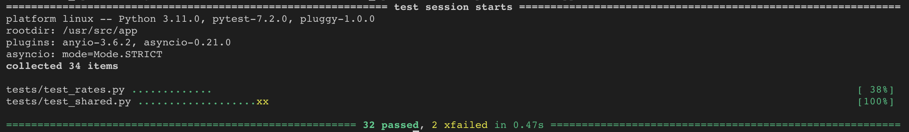

# Handled Edge cases and Validations Performed
- Captured API level exceptions
- Validations applied on date fields (date_from, date_to). Allowed format is YYYY-MM-DD.
- Validations applied on origin and destination field. 
    - Handled min-max length of string. So that these string fields are not exploited.
    - Disallowed punctuation characters (eg !@,*...) Only letters and underscores are accepted.
    - Provided origin and destination parameters are checked whether they are present in the database or not. So that relevant message can be returned in response.


# Some Assumptions and Considerations for Regions-Children Tree
When a region slug is passed as origin/destination we need to traverse its tree to get all its child regions (If applicable). And then we will select the port codes of the passed region and as well as port codes of its child regions (If applicable).

For Example:
when "CNSGH" is passed as origin and "scandinavia" is passed as destination. We get all child regions of "scandinavia". Which are:  
- 1. "kattegat"  
- 2. "norway_north_west"  
- 3. "norway_south_east"  
- 4. "norway_south_west"  
- 5. "stockholm_area" 

And then get the port codes of "scandinavia" and its child regions 1-5. And then query  average prices per day between geographic groups of ports.


# Tests
The development approach was TDD. Tests are implemented for shared utility methods and API endpoint. Tests can be found in directory *src/tests*.  
<br>
Execute the below command after running the docker-compose up. (Make sure you are in the same directory where docker-compose.yml is located.)

```
docker-compose exec web pytest .
``` 




# API code structure
```bash
├── Dockerfile
├── app
│   ├── __init__.py
│   ├── api
│   │   ├── __init__.py
│   │   ├── models
│   │   │   └── rates.py        # (Response Model for API endpoint)
│   │   ├── routes
│   │   │   └── rates.py        # (API endpoint)
│   │   └── utils               # (Shared utility methods)
│   │       ├── __init__.py
│   │       ├── crud.py
│   │       ├── queries.py      # (SQL queries)
│   │       └── shared.py       # Methods for validations and preloaded data
│   ├── db.py
│   ├── logging.conf
│   └── main.py                 # (API startup code)
├── logs
│   └── logfile.log
├── requirements.txt
└── tests                       # (Unit tests)
    ├── __init__.py
    ├── conftest.py
    ├── test_rates.py           # (Tests for the rates endpoints)
    └── test_shared.py          # (Tests for the shared utility methods)
```

# Setup and Execution

The docker compose file contains three services
- web: For the API
- db: For the postgres database
- pgadmin: Pgadmin client for database

Follow the instructions to run and test the project.  
<br>
Start docker compose
``` bash
docker compose up -d --build
```

<br>

Open the following link in the browser to test API: http://localhost:8002/docs. 

<br>


To view or query database through pgadmin, do the following:

``` bash
docker ps
```
Copy the the id of the postgres container. Use this id to check the IP address.


```bash
docker inspect <put-id-here> | grep IPAddress
```

The result will look something like this

```
"SecondaryIPAddresses": null,
"IPAddress": "",
        "IPAddress": "172.24.0.4",
```
Copy this IPAddress. Then Login to pgadmin web interface through http://localhost:5050. You can get the login and pass from docker-compose file. Register a server and use that IPAddress as host.